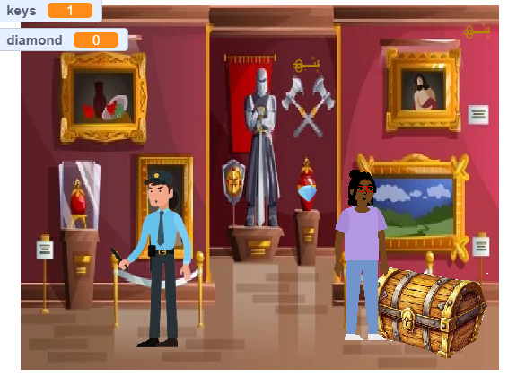

# Museum Heist

## Gameplay

Museum Heist is a Scratch game created for Harvard CS50 Week 0.

## Objective

Play as a thief attempting to steal a valuable diamond from a museum while avoiding a patrolling guard.

## How to Play

* Use the arrow keys to move.
* Collect all 3 keys.
* The diamond appears after all keys are collected.
* Avoid the guard before obtaining the diamond.
* Collect the diamond.
* Reach the chest to escape and win.

## Features

* Multiple sprites
* Variables (Keys, Diamond)
* Conditional logic
* Loops
* Custom block: moveGuard(speed)
* Win and lose conditions

## Built With

* Scratch
* Harvard CS50

